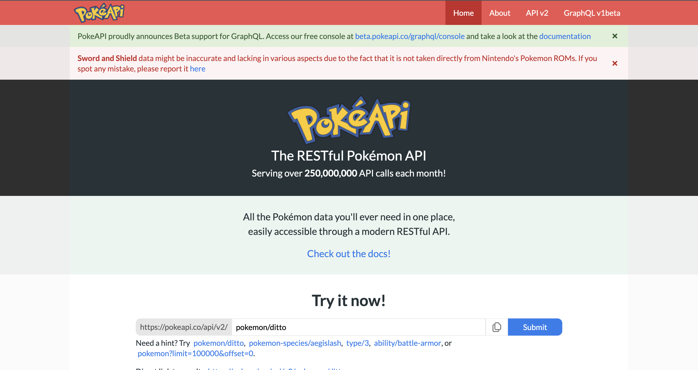
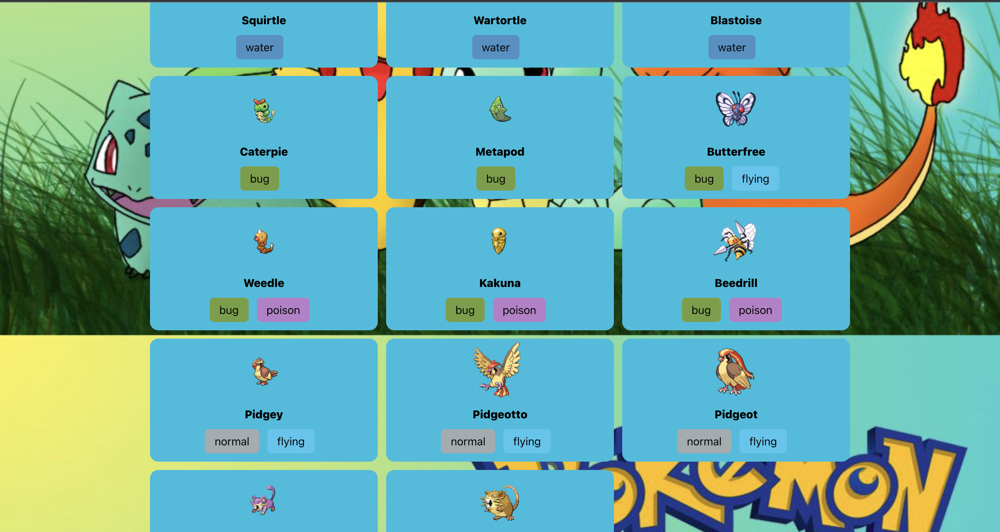

# Getting Started with Create React App

**Technologies** used were React, Javascript, CSS
---
I decided to use a Pokemon API

---
The background image gave me the most issues and i wasent able to figure out how to not have the image repeat id like to come back and fix that on a later date 
---
Here is my deployment Link https://63c05e3b9572225f547fb9d7--candid-dusk-124cd6.netlify.app/